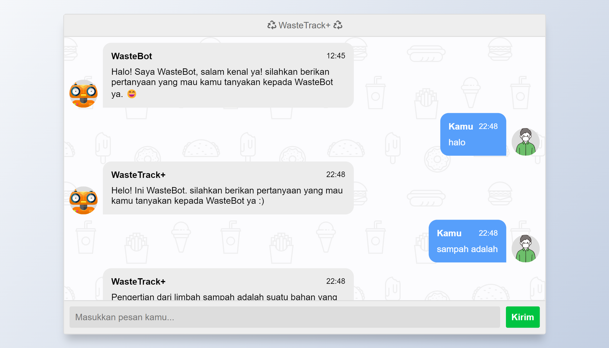

# WasteTrack Chatbot Flask

This project is a simple chatbot implemented using Flask, Python, and a model trained with **Bidirectional LSTM (BiLSTM)** and **Bidirectional GRU (BiGRU)** neural networks. The chatbot interacts with users, processes their input, and generates appropriate responses based on the trained model.

## 📷 Screenshot


## ✨ Prerequisites

- Python 3.x
- Flask
- TensorFlow (or Keras)
- scikit-learn
- NLTK

## 🤖 Installation

1. Clone the repository:
   ```shell
   git clone https://github.com/bimarakajati/WasteTrack-Chatbot-API.git
   ```

2. Install the required dependencies:
    ```shell
    pip install -r requirements.txt
    ```

## 💁‍ Usage

1. Run the Flask app:
   ```shell
   python main.py
   ```
2. Open your web browser and navigate to `http://localhost:5000/` to access the chatbot interface or run the following command for terminal chatbot:
   ```shell
   python chatbot.py
   ```
3. Start chatting with the chatbot by entering your messages in the input field and pressing Enter.
4. The chatbot will respond with generated replies based on the pre-trained model's predictions.

## ✨ Author

|             Name            |      NIM       |       Job Desk       |
| --------------------------- | -------------- |----------------------|
| Afrizal Mukti Pramutiansyah | A11.2019.11893 | Chatbot              |
| Bima Rakajati               | A11.2020.13088 | Flask                |

## 📙 Reference

Thanks to their great works：
- https://buffml.com/web-based-chatbot-using-flask-api/